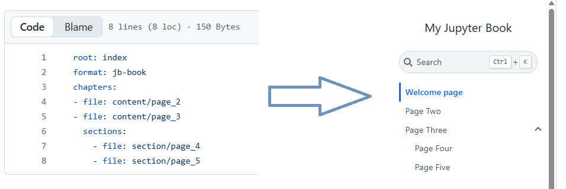
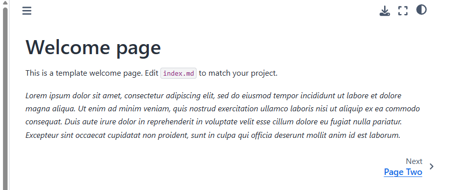
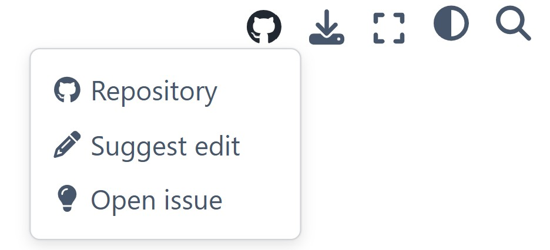
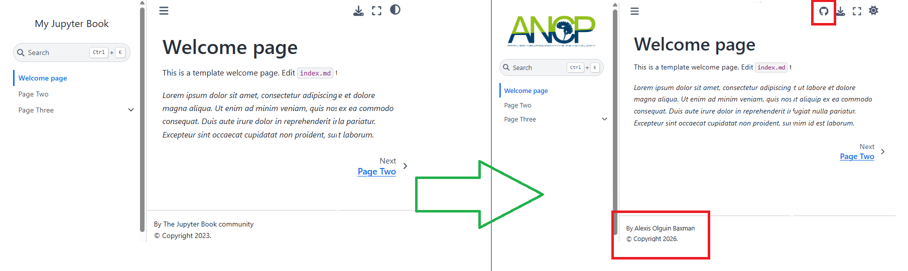
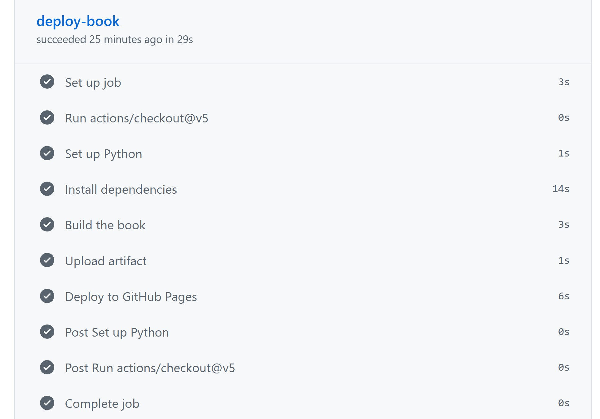
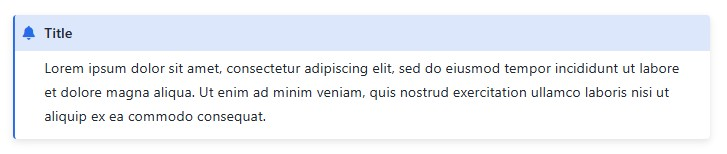

# Jupyter Book Template Manual

There are several workflows to create and work with Jupyter Book:
* **Canonical Jupyter Book workflow:** as described in the official Jupyter Book documentation, it requires to locally install Jupyter Book (via pip or conda-forge), initialiding a MyST project and use command line to build the book from local stored markdown files. This is the most standard approach and is useful for local preview.
* **GitHub direct workflow:** This is the workflow used for the MEGqc and BIDS-Manager documentation, and the one described in this protocol. You can create and edit your book by editing the repository files directly in GitHub, while GitHub Actions handles the building and deployment of the website. This workflow allows you to work remotely from the browser, without a local environment, without an installed CLI. 

## How to start
The quickest approach is to clone an existing repository that already builds and deploys successfully, and then adapt the files to your own needs.
To publish your documentation, go to Settings in your repository. In the left sidebar, open Pages, and under Build and deployment, select GitHub Actions as the source. Once this is set, GitHub will automatically provide the link to your Jupyter Book.
For this to work, the repository must be public.

## Essential files 

* `README.md`: This Markdown file defines the description shown on a repository's front page, such as the protocol you are currently reading. It follows standard Markdown rules (explained below). Feel free to modify it.

* `_toc.yml`: This YAML file defines the Jupyter Book structure, such as which pages (Markdown files) are included, their order and hierarchy. The pages are divided in `chapters` (top-level pages) and `sections` (nested pages under a chapter). The `_toc.yml` references each page by its relative path without the .md extension. In the example below you can see how:
  * Pages 4 and 5 (`sections`) are nested pages under page 3 (`chapter`).
  * The order and hierarchy will be reflected in the compiled Jupyter Book's left navigation panel.
  * It's recommended to keep the pages organized in folders (e.g., content/, section/). 
  


<br>


* `index.md`: by convention, "index.md" is the filename use for the welcome page of the Jupyter Book. It typically includes a brief overview of what the documentation is for, who it is intended for (e.g., beginners vs. advanced users), any prerequisites (e.g., Python, required software, background knowledge), links for support (e.g., contact email, GitHub Issues), and optional sections such as acknowledgements or citations.



<br>


* `_config.yml`: This YAML file customizes some metadata elements of the Jupyter Book's such as title, author and logo. The book can still build without this file, but it's highly recommended to have a basic customization.
  * The `_config.yml` file in this repository is quite basic, but many other advance functions and settings are available, check the [Jupyter Book Configuration reference page](https://jupyterbook.org/v1/customize/config.html).
  *  The  "HTML-specific" settings (line 15) allow you to turn on the GitHub button in the right-top corner. When hovering, you get quick access to the whole repository, to the edition page and to the issues page.'
  * The "myst_enable_extensions" setting (line 22) is necessary to work with raw HTML images. More about handling HTML images in the next section. 




<br>


* `.github/workflows/deploy.yml`: This YAML file includes the key instructions for GitHub Actions to compile the book. It activates every time any change happens in any file of the repository. `deploy.yml` sets up a Python environment, `pip` installs the dependencies, builds the book, and deploys the generated HTML. 
  * The `deploy.yml` in this repository is reduced to the essential configurations, taken from the official [GitHub Pages and Actions](https://jupyterbook.org/v1/publish/gh-pages.html).
  * The `Actions` tab of the repository shows you these steps as they progress as well as where they fall.





<br>

* `requirements.txt`: A plain text file listing the Python packages required to build the Jupyter Book. During deployment,  the specified dependencies in this text file get `pip` installed. 
   * For a very basic Jupyter Book (like this template), specifying `jupyter-book==1.0.0` in requirements.txt is sufficient. However, additional dependencies or specific versions of extensions can be added as needed (for example, `sphinx==7.4.7`).
   * It is also possible to install packages directly in the deployment YAML file (`deploy.yml`), but this can lead to conflicts with the dependencies specified in `requirements.txt`.

* `LICENSE`: Defines the license of the repository. GitHub automatically detects this file and displays the license badge/icon alongside the README. This repository includes an MIT License that you can copy-paste without modification. For a detailed explanation of how GitHub handles repository licenses, see the [official documentation.](https://docs.github.com/en/repositories/managing-your-repositorys-settings-and-features/customizing-your-repository/licensing-a-repository)


## Images

* By convention, the images used throughout your documentation are contained in the `/static` folder.
  * The images shown in this README are stored in the `\pics` subfolder inside the static folder. This subfolder is only provided as an example and can be safely removed.
* To display an image using raw HTML in Markdown, we recommend the following syntax:

```bash

```

  * You need to provide the relative path to the image file, including all subfolders and its extension (e.g. .png, .jpg, or .gif). 
  * This command line allows you to control the image size and alignment on the page.

## Cheatsheet

* [Quickstart tutorial of writting in Markdown by Jupyter Book community](https://jupyterbook.org/stable/get-started/create-content/)
* Bash block: this block allows you to write command lines that won't be interpretated and creates a copy-paste button.

````bash

  ```bash


  ``` 

```` 


* Admonition: Admonitions are highlighted content blocks. The visual appearance of an admonition can be customized using the `class` option:
   * `tip`: changes the fram color to green.
   * `warning`: changes the from color to orange.
   * `dropdown`: makes the content collapsible.
 
````bash

```{admonition} Title
:class: tip

Lorem ipsum dolor sit amet, consectetur adipiscing elit, sed do eiusmod tempor incididunt ut labore et dolore magna aliqua. Ut enim ad minim veniam, quis nostrud exercitation ullamco laboris nisi ut aliquip ex ea commodo consequat.


```
````




* Comment out: You can comment out parts that are not rendered in the final Jupyter Book.

  
```bash

<!--

This content will not appear in the final deployment.

-->

```


